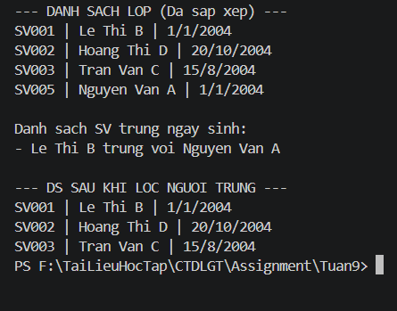
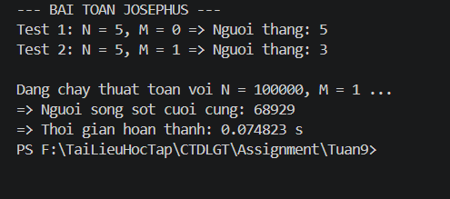

# Bài tập thực hành Tuần 9 - CTDLGT

Thông tin sinh viên:
- Họ và tên: Vũ Quang Duy
- MSSV: 20223936

## Danh sách bài tập
1. **Bài 1: Quản lý sinh viên**
   - Sử dụng Danh sách liên kết đơn để quản lý thông tin sinh viên.
   - Chức năng: Sắp xếp theo tên và lọc sinh viên cùng ngày sinh.
2. **Bài 2: Bài toán Josephus**
   - Sử dụng Danh sách liên kết vòng.
   - Kết quả: Thuật toán tối ưu chạy mượt với N = 100.000.

## Kết quả thực hiện
- Ảnh kết quả Bài 1: 
- Ảnh kết quả Bài 2: 